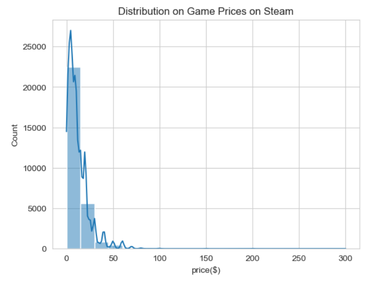
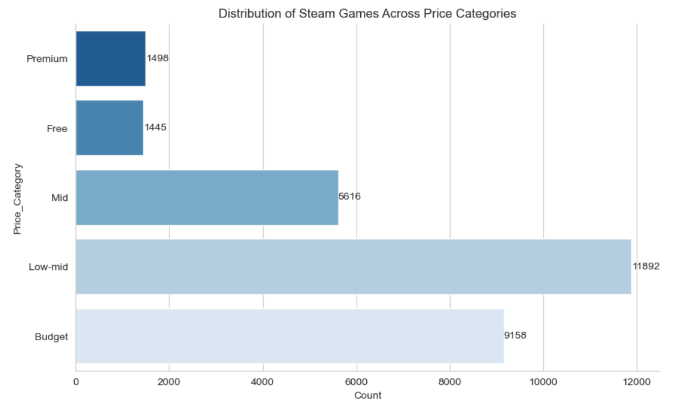
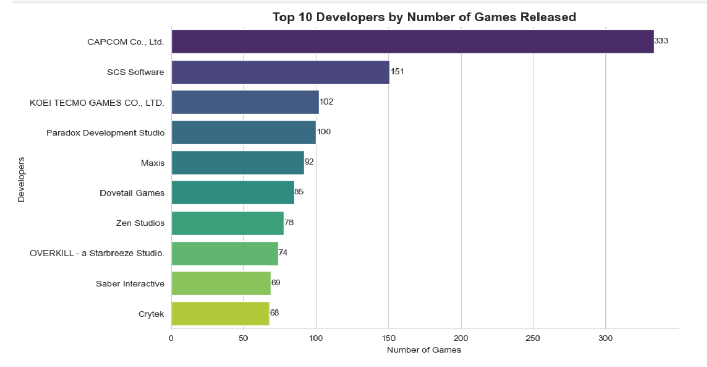
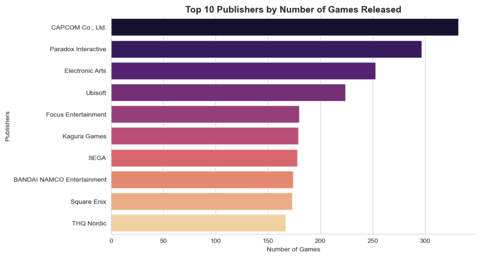
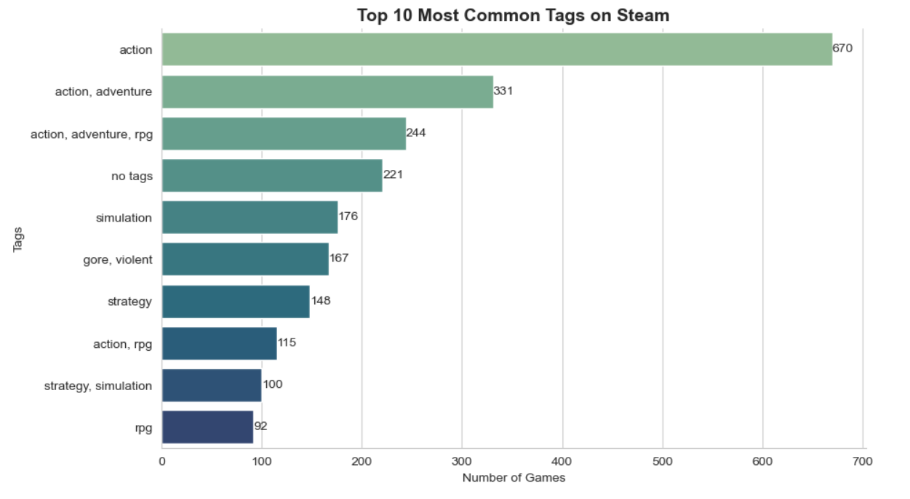
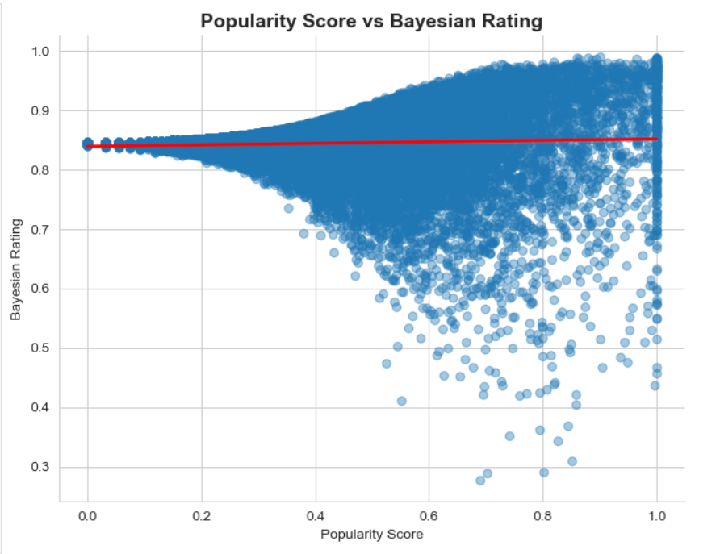
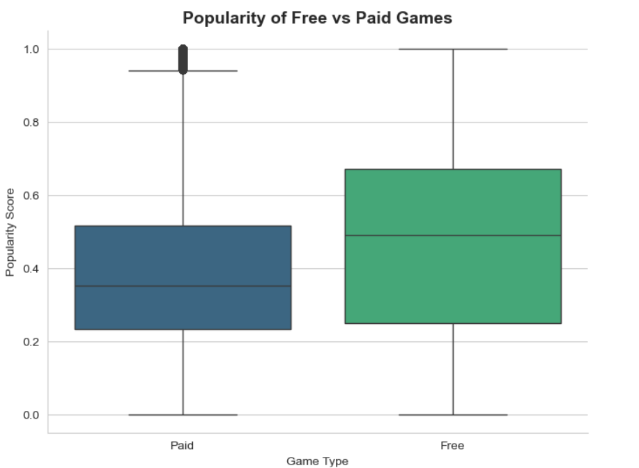

# 🎮 Steam Games Data Analysis using Python

## Exploratory Data Analysis (EDA) Project

This project performs Exploratory Data Analysis (EDA) on a Steam Games dataset to understand patterns in game pricing, developers, publishers, tags, popularity, and ratings.

The analysis uses Python to explore the dataset, assess data quality, visualize important patterns, and generate insights from the available Steam game data.

## 🎯 Project Objectives

- Understand the structure of the Steam Games dataset
- Assess data quality and missing values
- Explore game pricing and price categories
- Identify developers and publishers with the highest number of games
- Analyze the most common Steam game tags
- Examine the relationship between popularity score and Bayesian rating
- Compare the popularity of free and paid games
- Generate meaningful insights through data visualization


## 📊 Dataset

The dataset contains information about Steam games, including game details, pricing, reviews, developers, publishers, tags, and system requirements.

### Dataset Download

The dataset is hosted on Google Drive because the CSV file exceeds GitHub's browser upload limit.

**[Download Steam Games Dataset](https://drive.google.com/file/d/1xR_p7zZ3K7qxkolE16Ajs1hEiG1zn7yj/view?usp=sharing)**

After downloading the dataset, place `SteamGames_cleaned.csv` inside the `Data` folder of this project.

The notebook loads the dataset using:

steam = pd.read_csv("Data/SteamGames_cleaned.csv")


## 🛠️ Tools & Technologies

- Python
- Pandas
- NumPy
- Matplotlib
- Seaborn
- Jupyter Notebook

## 📊 Analysis Performed

### 1. Distribution of Game Prices

The analysis examines how Steam game prices are distributed.



**Key insight:** Most games in the dataset are priced below $20, while higher-priced games are relatively less common.

---

### 2. Distribution Across Price Categories

The project compares the number of games across different price categories.



**Key insight:** Low-mid priced games form the largest category, followed by budget games.

---

### 3. Top 10 Developers

The analysis identifies developers with the highest number of games in the dataset.



**Key insight:** CAPCOM Co., Ltd. has the highest number of games among the developers represented in the dataset.

---

### 4. Top 10 Publishers

The project also analyzes publishers based on the number of games released.



**Key insight:** CAPCOM Co., Ltd. has the highest number of published games in the dataset, with several other major publishers also appearing among the leading publishers.

---

### 5. Most Common Steam Tags

The analysis identifies the most frequently occurring game tags.



**Key insight:** Action is the most common tag in the dataset, with combinations involving Action, Adventure, and RPG also appearing frequently.

---

### 6. Popularity Score vs Bayesian Rating

A scatter/regression analysis is used to examine the relationship between popularity score and Bayesian rating.



**Key insight:** The analysis indicates a weak relationship between popularity score and Bayesian rating. Popularity does not necessarily correspond to a substantially higher rating.

---

### 7. Free vs Paid Games

The project compares popularity scores between free and paid games.



**Key insight:** Free games have a slightly higher median popularity score in this dataset, while both groups show considerable variation and overlap.

## 🔎 Key Findings

- Most Steam games in the dataset are priced below $20.
- Low-mid and budget price categories contain the highest number of games.
- CAPCOM Co., Ltd. appears as the leading developer and publisher by number of games in this dataset.
- Action is the most common game tag.
- Popularity score and Bayesian rating show a weak relationship.
- Free games have a slightly higher median popularity score than paid games.

## 📁 Project Structure

```text
Steam_Analysis/
│
├── EDA_Steam_games.ipynb
│
├── Data/
│   └── SteamGames_cleaned.csv
│
└── Images/
    ├── free_vs_paid.png
    ├── popularity_vs_rating.png
    ├── price_categories.png
    ├── price_distribution.png
    ├── top_developers.png
    ├── top_publishers.png
    └── top_tags.png
```

## ▶️ How to Run the Project

1. Clone or download this repository.
2. Make sure Python is installed.
3. Install the required libraries:

```bash
pip install -r requirements.txt
```

4. Open `EDA_Steam_games.ipynb` in Jupyter Notebook or JupyterLab.
5. Run the notebook cells from top to bottom.

The notebook loads the dataset using the relative path:

```python
pd.read_csv("Data/SteamGames_cleaned.csv")
```

## 💡 Skills Demonstrated

- Data Loading
- Data Quality Assessment
- Exploratory Data Analysis
- Data Visualization
- Statistical/Descriptive Analysis
- Data Interpretation
- Business Insight Generation

## 👤 Author

**Mihir Gharat**
